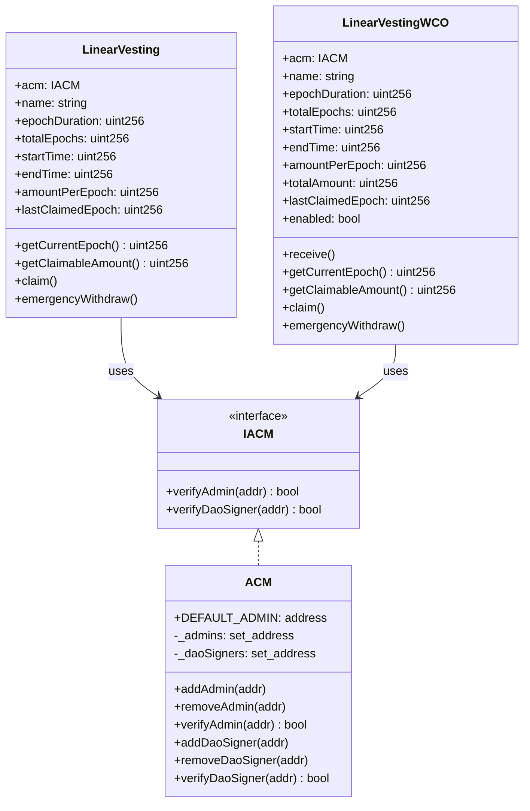
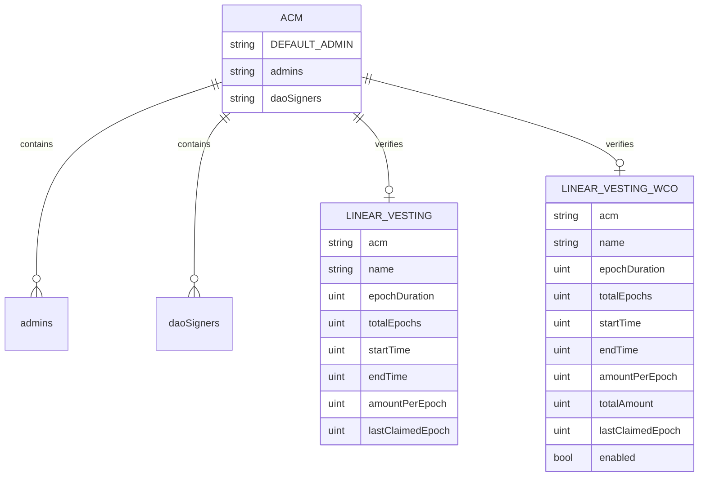

# Vesting Contracts (W Chain)

Linear ETH vesting for W Chain. Two variants:
- Constructor-funded: escrow ETH at deployment
- WCO-funded: configure totals, enable once funded via receive()

Audience: internal devs/maintainers.

## Repository Map
- Contracts
  - [ACM.sol](file:///Users/evanstinger/Dev/w-chain/vesting-contracts/src/ACM.sol): minimal access-control manager
  - [LinearVesting.sol](file:///Users/evanstinger/Dev/w-chain/vesting-contracts/src/LinearVesting.sol): constructor-funded vesting
  - [LinearVestingWCO.sol](file:///Users/evanstinger/Dev/w-chain/vesting-contracts/src/LinearVestingWCO.sol): fund-to-enable variant
  - [IACM.sol](file:///Users/evanstinger/Dev/w-chain/vesting-contracts/src/interfaces/IACM.sol): ACM interface used by vesting
- Scripts
  - [DeployACM.s.sol](file:///Users/evanstinger/Dev/w-chain/vesting-contracts/script/DeployACM.s.sol)
  - [DeployVesting.s.sol](file:///Users/evanstinger/Dev/w-chain/vesting-contracts/script/DeployVesting.s.sol)
  - [ClaimAll.s.sol](file:///Users/evanstinger/Dev/w-chain/vesting-contracts/script/ClaimAll.s.sol)
- Tests
  - [LinearVesting.t.sol](file:///Users/evanstinger/Dev/w-chain/vesting-contracts/test/LinearVesting.t.sol)
  - [LinearVestingWCO.t.sol](file:///Users/evanstinger/Dev/w-chain/vesting-contracts/test/LinearVestingWCO.t.sol)
- Config
  - [foundry.toml](file:///Users/evanstinger/Dev/w-chain/vesting-contracts/foundry.toml): W Chain RPC + scan settings

## Architecture Overview


## Roles & Access
- Roles via [ACM](file:///Users/evanstinger/Dev/w-chain/vesting-contracts/src/ACM.sol)
  - DEFAULT_ADMIN (deployer): can remove admins/signers
  - Admins: authorized to claim vesting
  - DAO Signers: authorized to emergencyWithdraw
- Vesting gates
  - onlyClaimer → acm.verifyAdmin(msg.sender)
  - onlyDaoSigner → acm.verifyDaoSigner(msg.sender)

## Vesting Flow
```mermaid
sequenceDiagram
    participant Admin as Admin (verifyAdmin)
    participant DAO as DAO Signer (verifyDaoSigner)
    participant ACM
    participant Vest as LinearVesting/LinearVestingWCO

    rect rgb(235,245,255)
    note over Vest: Create schedule
    Admin->>Vest: deploy constructor(..., value=amount) [constructor-funded]
    note over Vest: or deploy then receive(totalAmount) [WCO]
    end

    rect rgb(245,255,245)
    note over Vest: Epoch accrual
    Admin->>Vest: getClaimableAmount()
    Vest-->>Admin: claimable
    Admin->>Vest: claim()
    Vest->>Admin: transfer ETH
    Vest->>Vest: update lastClaimedEpoch
    end

    rect rgb(255,245,245)
    alt Final Epoch
        Admin->>Vest: claim()
        Vest->>Admin: transfer remaining balance
        Vest->>Vest: set lastClaimedEpoch = totalEpochs
    else Emergency
        DAO->>ACM: verifyDaoSigner(DAO)
        ACM-->>DAO: true
        DAO->>Vest: emergencyWithdraw()
        Vest->>DAO: transfer all balance
        Vest->>Vest: set lastClaimedEpoch = totalEpochs
    end
```

## Storage Model


## Contracts
- ACM
  - Purpose: simple role registry using OZ EnumerableSet
  - API: add/remove Admin, add/remove DaoSigner, verify* (view)
  - DEFAULT_ADMIN set at construction; can remove others
- LinearVesting (constructor-funded)
  - Immutables: epochDuration, totalEpochs, startTime, endTime, amountPerEpoch
  - State: lastClaimedEpoch
  - Functions: getCurrentEpoch, getClaimableAmount, claim, emergencyWithdraw
  - Emits: VestingCreated, VestingClaimed, VestingCompleted, EmergencyWithdrawal
- LinearVestingWCO (fund-to-enable)
  - Adds: totalAmount, enabled, receive()
  - Enable on first funding ≥ totalAmount; supports excess; final claim drains remainder
- IACM
  - View interface for ACM verification used by vesting contracts

## Interactions & Dependencies
- Imports: vesting → [IACM](file:///Users/evanstinger/Dev/w-chain/vesting-contracts/src/interfaces/IACM.sol); ACM uses OZ EnumerableSet
- No inheritance between local contracts; no upgradeability; constructors fix parameters
- Cross-calls: vesting queries ACM for role checks; transfer via call to msg.sender

## Deployment
- Config: [foundry.toml](file:///Users/evanstinger/Dev/w-chain/vesting-contracts/foundry.toml)
  - solc 0.8.20; OZ remapping; W Chain scan + RPC endpoints
- Scripts
  - Deploy ACM: `forge script script/DeployACM.s.sol --rpc-url $RPC --private-key $PK --broadcast`
  - Deploy Vesting (WCO variant): [DeployVesting.s.sol](file:///Users/evanstinger/Dev/w-chain/vesting-contracts/script/DeployVesting.s.sol)
    - Constants: EPOCH_DURATION=15d, START_TIME=1748779200
    - Deploys named allocations; see script for amounts/epochs
  - Claim All: [ClaimAll.s.sol](file:///Users/evanstinger/Dev/w-chain/vesting-contracts/script/ClaimAll.s.sol)
    - Requires DEPLOYER_PK in env; claims from predefined vesting addresses

## Testing
- Run: `forge test -vv`
- Coverage focus
  - Epoch math, claim accrual, final drain
  - Access control: admin vs unauthorized, DAO signer emergency
  - WCO: funding path (exact/insufficient/repeated/excess), partial-claim then emergency
- See: [LinearVesting.t.sol](file:///Users/evanstinger/Dev/w-chain/vesting-contracts/test/LinearVesting.t.sol), [LinearVestingWCO.t.sol](file:///Users/evanstinger/Dev/w-chain/vesting-contracts/test/LinearVestingWCO.t.sol)

## Operational Playbook
- Constructor-funded
  - Deploy with ETH value = total amount
  - Assign admins and DAO signers in ACM
  - Admins call claim() as epochs accrue
- WCO-funded
  - Deploy without value; fund once via plain ETH transfer ≥ totalAmount
  - Verify enabled == true; then same claim flow
- Emergency
  - DAO signer can emergencyWithdraw() to pull entire balance; marks vesting completed

## Known Issues / Caveats
- ACM onlyAdmin bug: condition currently `if (msg.sender != DEFAULT_ADMIN || _admins.contains(msg.sender)) revert`. Intended: revert when neither DEFAULT_ADMIN nor in admins. Safe fix:
  - `if (msg.sender != DEFAULT_ADMIN && !_admins.contains(msg.sender)) revert Unauthorized();`
  - Location: [ACM.sol#L26-L29](file:///Users/evanstinger/Dev/w-chain/vesting-contracts/src/ACM.sol#L26-L29)
- Reentrancy risk: claim() updates `lastClaimedEpoch` after transferring ETH. A malicious admin contract could reenter claim before state update. Mitigation:
  - Update state before transfer or add reentrancy guard; prefer checks-effects-interactions
- Naming quirk: [LinearVestingWCO.sol](file:///Users/evanstinger/Dev/w-chain/vesting-contracts/src/LinearVestingWCO.sol) defines contract named `LinearVesting`; scripts/tests import from that file. Keep consistent or rename class for clarity.
- Beneficiary model: funds go to caller (admin/DAO signer). If a fixed treasury is desired, store beneficiary and send to it.

## Dev Commands
- Build: `forge build`
- Format: `forge fmt`
- Snapshot gas: `forge snapshot`
- Local node: `anvil`
- Verify (W Chain): set etherscan entries in foundry.toml; use `forge verify-contract`

## Domain Assumptions
- Linear vesting by epochs; epoch = floor((now - startTime)/epochDuration), capped at totalEpochs
- ETH only; no tokens; no pause; no upgrade paths; immutables lock params
- Admins/DAO signers are controlled via ACM; DEFAULT_ADMIN is ACM deployer
